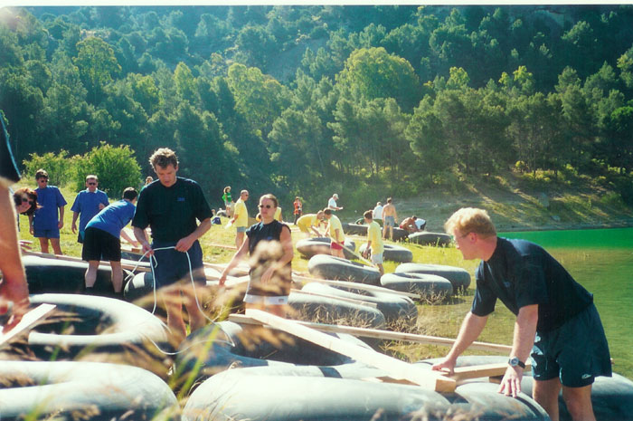
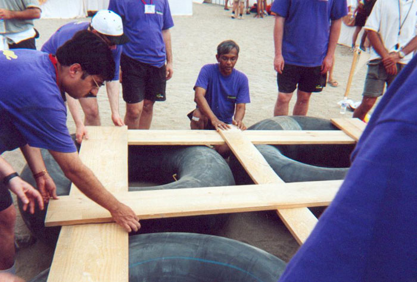
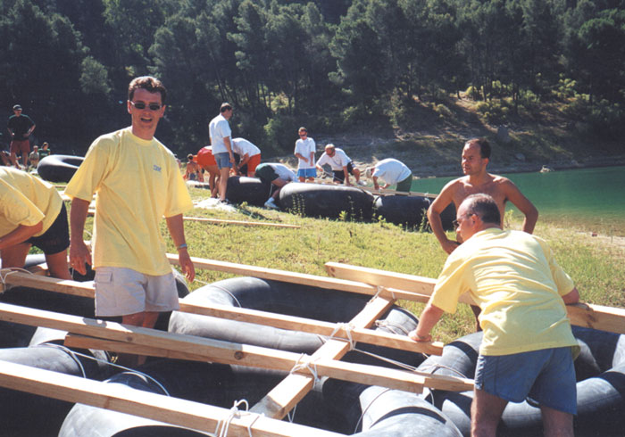
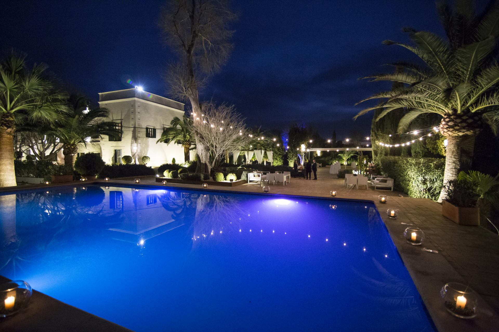
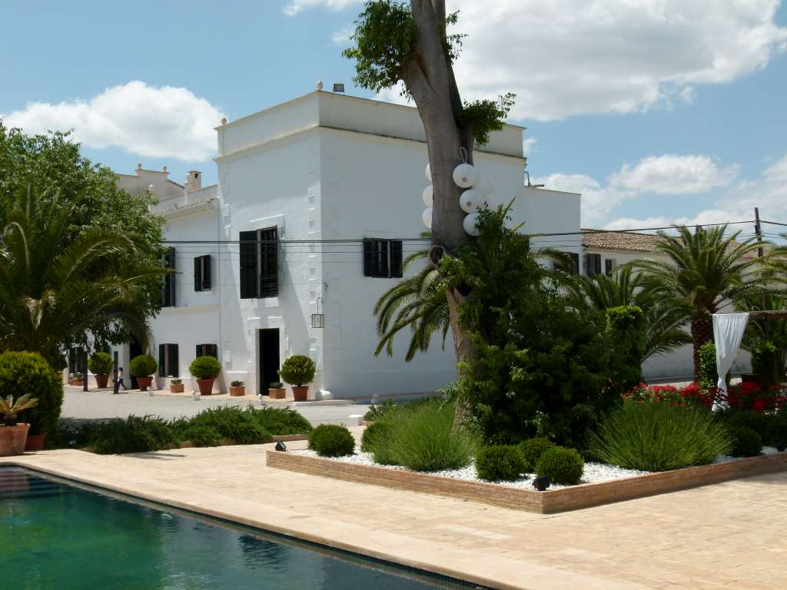

<script> 
    $(document).ready(function() { 
    $head = $('#header'); 
    $head.prepend('<A href = https://www.cuttingedge-events.com></A>') 
    }); 
</script> 


```{r echo=FALSE, message=FALSE,warning=FALSE}
library(readxl)
library(shiny)
library(dplyr)
library(knitr)
```

<head>
<link rel="stylesheet" href="https://cdnjs.cloudflare.com/ajax/libs/font-awesome/4.7.0/css/font-awesome.min.css">
</head>

## **PROPOSED ACTIVITIES** {.tabset .tabset-fade .tabset-pills}

### **RAFT BUILDING PROJECT**

After receiving some basic tuition in navigation, the participants must pass the Robinson Crusoe Raft Navigation Test. Then they will be given a raft design kit and be assigned a budget to purchase everything they need to build a raft. Finally, all the teams will compete in a regatta with their creations.

<div class="clearfix">
  <div class="img-container" style="float: left;
  width: 33.33%;
  padding: 5px;">
  
  </div>
  <div class="img-container" style="float: left;
  width: 33.33%;
  padding: 5px;">
  
  </div>
  <div class="img-container" style="float: left;
  width: 33.33%;
  padding: 5px;">
  
  </div>
  <div style="clear: both;"></div>
</div>  
<hr><br>

<style>
p.comment {
background-color: #ffcc99;
padding: 10px;
border: 1px solid black;
border-radius: 5px;
}
</style>

<p class="comment">
The cost will be: 
Flat rate of €1500 
Rate per person €121 </p>

<style>
p.comment {
background-color:ffcc99 ;
padding: 10px;
border: 1px solid black;
border-radius: 5px;
}
</style>

<p class="comment">
*To these rates we will need to add the rent of the venue and transfer* </p>

** The price of our event includes**:

- Telephone conversation in order to ascertain the requirements of the client.
- Reservation of the agreed venue.
- Setting up and dismantling of the entire event.
- Transport of necessary materials to the site of the event.
- Use of all the materials necessary to the event.
- Team fees (Project manager and monitors).
- Qualified, uniformed personnel.
- Setting up of 9m2 (3x3) canvas tents (where possible).
- Certain decorative elements depending on the event, such as banners and cordons.
- Transport and expenses of our personnel.
- Prize giving ceremony.
- Medal for each member of the three winning teams.


#### **SUGESTED VENUE FOR THE ACTIVITY: MASIA ALDAMAR**

* **Location** 25 minutes drive from Valencia city centre
* **Facilities** Gardens and Pool 

**Masía Aldamar** is a spectacular country estate, dedicated to orange growing, just 15km from the centre of Valencia and a mere 5 minutes from the airport. The estate dates from the(**15th century** and still maintains its original patios, wineries, oil press and chapel. The unique spaces offer the chance to hold one-of-a-kind events: the chapel for civil ceremonies, an ancient cobbled patio, a large capacity main hall and a hundred-year-old garden with the traditional pool that is a feature of Valencia ́s orange growing activity. There is also a second winery where the estate’s original wine-making activity has been revived.


<div class="clearfix">
  <div class="img-container" style="float: left;
  width: 50%;
  padding: 5px;">
  
  </div>
  <div class="img-container" style="float: left;
  width: 50%;
  padding: 5px;">
  
  </div>
  <div style="clear: both;"></div>
</div>  
<hr><br>

<style>
p.comment {
background-color: #ffcc99;
padding: 10px;
border: 1px solid black;
border-radius: 5px;
}
</style>


<p class="comment">
Hire cost of the venue minimum charge €2400
Open bar 2 hours during the activity including soft drinks, beer and water. Rate per person from €18 </p>

<style>
p.comment {
background-color:ffcc99 ;
padding: 10px;
border: 1px solid black;
border-radius: 5px;
}
</style>

<p class="comment">
*Transfer is needed to arrive the venue - the cost of 54 seater coach 4 hours at disposal for the activity starting at 430€* </p>


### **COOKING CHALLENGE**

* **Location** CITY CENTRE
* **Facilities** Food and fun space 
* **Duration** 18h to 22h

_What can be more rewarding and exciting than knowing that you can prepare something delicious? What's more pleasant than seeing you in that wonderful place where the difference between work and fun disappears in a cloud of flour, in the aromatic steam that comes out of a pot or between glasses of a good red wine?_

A different and exciting gastronomic experience in the **"Master Chef"** style in which the participants will elaborate **different tapas recipes** and compete for the best results following the chef's guidelines. At least **one of the recipes will be creative**, based on a main ingredient determined by the chef, with the rest of the ingredients being freely chosen.

Attendees, organized into **work teams**, will **cook the dishes with local products** in a time limit. On the other hand, the teams will be free to give free rein to their imagination and intuition when it comes to developing the creative tapa. A **market zone** will be offered in which all the ingredients necessary to make the tapas will be found.

The objective will be to discover talents and promote the cohesion of the group from a cook born of emotions, governed by intuition and spontaneity, where you put the limits. Cuisine made from the heart so that each dish is an experience.

At the end **the group will taste** and share everything prepared in a unique and unforgettable dinner, because a good bite remains in the memory forever. The dishes, as well as the work of each team, will be valued and scored by the chef, who will **reward the winners*.**

<div class="clearfix">
  <div class="img-container" style="float: left;
  width: 33.33%;
  padding: 5px;">
  
  </div>
  <div class="img-container" style="float: left;
  width: 33.33%;
  padding: 5px;">
  
  </div>
  <div class="img-container" style="float: left;
  width: 33.33%;
  padding: 5px;">
  
  </div>
  <div style="clear: both;"></div>
</div>  
<hr><br>


<style>
p.comment {
background-color: #ffcc99;
padding: 10px;
border: 1px solid black;
border-radius: 5px;
}
</style>


<p class="comment">
Total cost of the activity for 50 people is €6400
Including: Exclusive space, organiztion, staff, 3 professinal chefs, purchase of ingredients for 50 people, Drinks (welcome cocktail, water, beer and 3 glasses of wine from Valencia for 50 pax) and somelier </p>

<style>
p.comment {
background-color:ffcc99 ;
padding: 10px;
border: 1px solid black;
border-radius: 5px;
}
</style>

<p class="comment">
*Transfer is needed to arrive the venue - the cost of 54 seater coach 4 hours at disposal for the activity starting at 430€* </p>


*****

## Terms & Conditions

  * Rates valid for 2019.
  
  * For a group of minimum 50 pax.
  
  * Cutting Edge Events management fee including in the detailed rates
  
  * VAT included. 
  
  * No reservation has been done. Availability upon request.
  
*****
