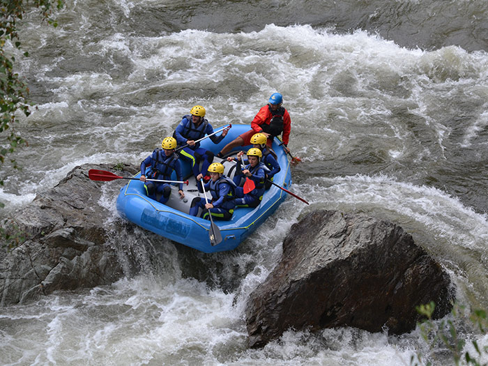
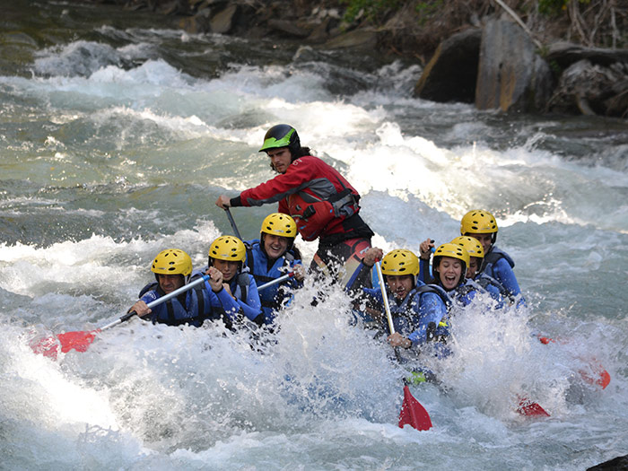
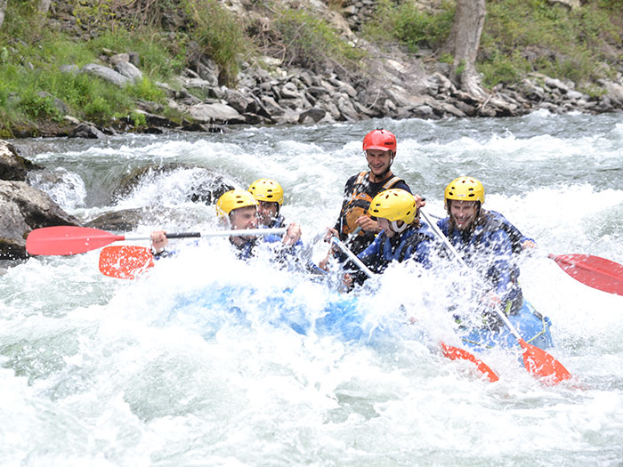
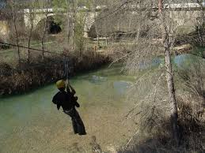
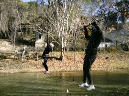
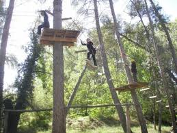

<script> 
    $(document).ready(function() { 
    $head = $('#header'); 
    $head.prepend('<A href = https://www.cuttingedge-events.com></A>') 
    }); 
</script> 


```{r echo=FALSE, message=FALSE,warning=FALSE}
library(readxl)
library(shiny)
library(dplyr)
library(knitr)
```

<head>
<link rel="stylesheet" href="https://cdnjs.cloudflare.com/ajax/libs/font-awesome/4.7.0/css/font-awesome.min.css">
</head>

## **PROPOSED ACTIVITIES** {.tabset .tabset-fade .tabset-pills}

### **RAFT BUILDING PROJECT**

After receiving some basic tuition in navigation, the participants must pass the Robinson Crusoe Raft Navigation Test. Then they will be given a raft design kit and be assigned a budget to purchase everything they need to build a raft. Finally, all the teams will compete in a regatta with their creations.

<div class="clearfix">
  <div class="img-container" style="float: left;
  width: 33.33%;
  padding: 5px;">
  
  </div>
  <div class="img-container" style="float: left;
  width: 33.33%;
  padding: 5px;">
  
  </div>
  <div class="img-container" style="float: left;
  width: 33.33%;
  padding: 5px;">
  
  </div>
  <div style="clear: both;"></div>
</div>  
<hr><br>

<style>
p.comment {
background-color: #ffcc99;
padding: 10px;
border: 1px solid black;
border-radius: 5px;
}
</style>

<p class="comment">
The cost will be: 
Flat rate of €1450
Rate per person €118 </p>

<style>
p.comment {
background-color:ffcc99 ;
padding: 10px;
border: 1px solid black;
border-radius: 5px;
}
</style>

<p class="comment">
*To these rates we will need to add the rent of the venue and transfer* </p>

** The price of our event includes**:

- Telephone conversation in order to ascertain the requirements of the client.
- Reservation of the agreed venue.
- Setting up and dismantling of the entire event.
- Transport of necessary materials to the site of the event.
- Use of all the materials necessary to the event.
- Team fees (Project manager and monitors).
- Qualified, uniformed personnel.
- Setting up of 9m2 (3x3) canvas tents (where possible).
- Certain decorative elements depending on the event, such as banners and cordons.
- Transport and expenses of our personnel.
- Prize giving ceremony.
- Medal for each member of the three winning teams.


#### **SUGESTED VENUE FOR THE ACTIVITY: MASIA ALDAMAR**

* **Location** 25 minutes drive from Valencia city centre
* **Facilities** Gardens and Pool 

**Masía Aldamar** is a spectacular country estate, dedicated to orange growing, just 15km from the centre of Valencia and a mere 5 minutes from the airport. The estate dates from the(**15th century** and still maintains its original patios, wineries, oil press and chapel. The unique spaces offer the chance to hold one-of-a-kind events: the chapel for civil ceremonies, an ancient cobbled patio, a large capacity main hall and a hundred-year-old garden with the traditional pool that is a feature of Valencia ́s orange growing activity. There is also a second winery where the estate’s original wine-making activity has been revived.


<div class="clearfix">
  <div class="img-container" style="float: left;
  width: 50%;
  padding: 5px;">
  
  </div>
  <div class="img-container" style="float: left;
  width: 50%;
  padding: 5px;">
  
  </div>
  <div style="clear: both;"></div>
</div>  
<hr><br>

<style>
p.comment {
background-color: #ffcc99;
padding: 10px;
border: 1px solid black;
border-radius: 5px;
}
</style>


<p class="comment">
Hire cost of the venue minimum charge €2200
Open bar 2 hours during the activity including soft drinks, beer and water. Rate per person from €16 </p>

<style>
p.comment {
background-color:ffcc99 ;
padding: 10px;
border: 1px solid black;
border-radius: 5px;
}
</style>

<p class="comment">
*Transfer is needed to arrive the venue - the cost of 54 seater coach 4 hours at disposal for the activity starting at 430€* </p>


### **COOKING CHALLENGE**

* **Location** CITY CENTRE
* **Facilities** Food and fun space 
* **Duration** 18h to 22h

_What can be more rewarding and exciting than knowing that you can prepare something delicious? What's more pleasant than seeing you in that wonderful place where the difference between work and fun disappears in a cloud of flour, in the aromatic steam that comes out of a pot or between glasses of a good red wine?_

A different and exciting gastronomic experience in the **"Master Chef"** style in which the participants will elaborate **different tapas recipes** and compete for the best results following the chef's guidelines. At least **one of the recipes will be creative**, based on a main ingredient determined by the chef, with the rest of the ingredients being freely chosen.

Attendees, organized into **work teams**, will **cook the dishes with local products** in a time limit. On the other hand, the teams will be free to give free rein to their imagination and intuition when it comes to developing the creative tapa. A **market zone** will be offered in which all the ingredients necessary to make the tapas will be found.

The objective will be to discover talents and promote the cohesion of the group from a cook born of emotions, governed by intuition and spontaneity, where you put the limits. Cuisine made from the heart so that each dish is an experience.

At the end **the group will taste** and share everything prepared in a unique and unforgettable dinner, because a good bite remains in the memory forever. The dishes, as well as the work of each team, will be valued and scored by the chef, who will **reward the winners*.**

<div class="clearfix">
  <div class="img-container" style="float: left;
  width: 33.33%;
  padding: 5px;">
  
  </div>
  <div class="img-container" style="float: left;
  width: 33.33%;
  padding: 5px;">
  
  </div>
  <div class="img-container" style="float: left;
  width: 33.33%;
  padding: 5px;">
  
  </div>
  <div style="clear: both;"></div>
</div>  
<hr><br>


<style>
p.comment {
background-color: #ffcc99;
padding: 10px;
border: 1px solid black;
border-radius: 5px;
}
</style>


<p class="comment">
Total cost of the activity for 50 people is €6145
Including: Exclusive space, organiztion, staff, 3 professinal chefs, purchase of ingredients for 50 people, Drinks (welcome cocktail, water, beer and 3 glasses of wine from Valencia for 50 pax) and somelier </p>

<style>
p.comment {
background-color:ffcc99 ;
padding: 10px;
border: 1px solid black;
border-radius: 5px;
}
</style>

<p class="comment">
*Transfer is needed to arrive the venue - the cost of 54 seater coach 4 hours at disposal for the activity starting at 430€* </p>


### **IPAD TREASURE HUNT**

* **Location** Any location

* **Included** Briefing for the group, 1 ipad per team (teams 6/9 pax), game licence, onsite technical support and trophy for the 3 best teams. 

* **Capacity**  minimum 10 pax; máximum 250 pax.

The funniest way to discover a destination is to do it playing. We propose a race trough Valencia that will allow to guests discover the city and all its secrets. We will create an app just for them totally customized, we will split them in teams that will compete in a race full of challenges. Each team will have 1 iPad and a bag with the needed materials. Each team will have from 6 to 9 participants-  The Challenges that they have to pass will be very different: sportive, logical, quizzes, etc. Follow the link to see a short video:

<iframe src="https://player.vimeo.com/video/288309048" width="640" height="360" frameborder="0" allow="autoplay; fullscreen" allowfullscreen></iframe>
<p><a href="https://vimeo.com/288309048">IPAD TREASURE HUNT video</a> from <a href="https://vimeo.com/user36870535">Cutting-Edge Events</a> on <a href="https://vimeo.com">Vimeo</a>.</p>


<style>
p.comment {
background-color: #ffcc99;
padding: 10px;
border: 1px solid black;
border-radius: 5px;
}
</style>


<p class="comment">
Total cost of the activity per person is 83€
</p>

<style>
p.comment {
background-color:ffcc99 ;
padding: 10px;
border: 1px solid black;
border-radius: 5px;
}
</style>

<p class="comment">
*Optional: Translation of the activty to French 485€* </p>


### **RAFTING TEAM**

* **Location** Venta del Moro - 1 hour driver from Valencia 

* **Duration of the activity** 3 hours transfer time not included - route in the river: 6 km. 

* **Teams**: 8/9 people 

Experience a white-water rafting adventure on the river Turia in Hoces del Cabrial with your colleagues. Don’t hesitate to join for a fun and exciting group activity!

· Explore the river  rafting the white water - route 6 km.

· You will cruise the rapids in a raft in the company of an experienced and professional guide.

· Your safety is the priority. And so is your enjoyment.


<div class="clearfix">
  <div class="img-container" style="float: left;
  width: 33.33%;
  padding: 5px;">
  
  </div>
  <div class="img-container" style="float: left;
  width: 33.33%;
  padding: 5px;">
  
  </div>
  <div class="img-container" style="float: left;
  width: 33.33%;
  padding: 5px;">
  
  </div>
  <div style="clear: both;"></div>
</div>  
<hr><br>


<style>
p.comment {
background-color: #ffcc99;
padding: 10px;
border: 1px solid black;
border-radius: 5px;
}
</style>


<p class="comment">
Total cost of the activity per person is 52€
</p>

<style>
p.comment {
background-color:ffcc99 ;
padding: 10px;
border: 1px solid black;
border-radius: 5px;
}
</style>

<p class="comment">
*Optional: 55 seater coach for the activity - 5 hours at disposal from 560€* </p>


### **MULTIACTIVITY**

* **Location** Venta del Moro - 1 hour driver from Valencia 

* **Duration of the activity** 3 hours transfer time not included 

* **Teams**: 8/9 people 

this an adventure park located in the Hoces del Cabriel, with more than 110 adventure activities suspended in the trees to enjoy a multi-adventure experience with your colleagues

Fun and excitement in a unique environment, with more than 500 meters of zip lines and more than 110 acrobatic activities. All this, prepared for you to live your own adventure.


<div class="clearfix">
  <div class="img-container" style="float: left;
  width: 33.33%;
  padding: 5px;">
  
  </div>
  <div class="img-container" style="float: left;
  width: 33.33%;
  padding: 5px;">
  
  </div>
  <div class="img-container" style="float: left;
  width: 33.33%;
  padding: 5px;">
  
  </div>
  <div style="clear: both;"></div>
</div>  
<hr><br>


<style>
p.comment {
background-color: #ffcc99;
padding: 10px;
border: 1px solid black;
border-radius: 5px;
}
</style>


<p class="comment">
Total cost of the activity per person is 57€
</p>

<style>
p.comment {
background-color:ffcc99 ;
padding: 10px;
border: 1px solid black;
border-radius: 5px;
}
</style>

<p class="comment">
*Optional: 55 seater coach for the activity - 5 hours at disposal from 560€* </p>


### **ALBUFERA NATIONAL PARK**

* **Location** 12km from Valencia, inside the Natural Park 

* **Duration of the activity** 2 hours Paella cooking activity plus dinner

* **Teams**: 8/9 people 

La Albufera is a freshwater lagoon and estuary on the Gulf of Valencia coast of the Valencian Community. It is the main portion of the Parc Natural de l'Albufera de València ("Valencian Albufera Natural Park"), with a surface area of 21,120 hectares (52,200 acres). The natural biodiversity of the nature reserve allows a great variety of flora and fauna to thrive and be observed year-round. Though once a saltwater lagoon, dilution due to irrigation and canals draining into the estuary and the sand bars increasing in size had converted it to freshwater by the seventeenth century.


The activity we suggest is a cooking activity in La Barraca del Palmar.
**¿What is Barraca?** Formerly, it was the typical dwelling in Valencia. It was used both for housing and for storage as well as for the fishermen. At present some are still preserved. You can find the ”modern" (built with materials other than traditional) and old ones. Many of the latter are in poor condition, due in some cases to the carelessness of the owners and the lack of interest for their conservation by official bodies. 
However “La Barraca del Palmar” of Albufera is restored to accommodate huge groups such as yours. Also, is pretty well located due to provides views to the lake.


**The activity** The activity will consist in a Paella  cooking. Paella is the most traditional dish in Valencia, and it has all kind of variations such as Vegetables paella, shellfish paella, etc.
The group will be split in different groups and each one will make their own paella. 
A set of instructors will be giving advise to the participants during the workshop.


**The dinner** Once they had finished with the workshop, they will have the pleasure to taste their own creations. But it won’t be a traditional dinner in a simple place… The dinner will take place in a at the barraca Gardens overlooking the lake


<style>
p.comment {
background-color: #ffcc99;
padding: 10px;
border: 1px solid black;
border-radius: 5px;
}
</style>


<p class="comment">
Total cost of the activity, dinner included, per person from 95€. Barraca hire cost 300€. Wc portable €200
</p>

<style>
p.comment {
background-color:ffcc99 ;
padding: 10px;
border: 1px solid black;
border-radius: 5px;
}
</style>

<p class="comment">
*55 seater coach for the activity - 4 hours at disposal from 400€* </p>


*****

## Terms & Conditions

  * Rates valid for 2019.
  
  * For a group of minimum 50 pax.
  
  * Cutting Edge Events management fee including in the detailed rates
  
  * VAT included. 
  
  * No reservation has been done. Availability upon request.
  
*****
